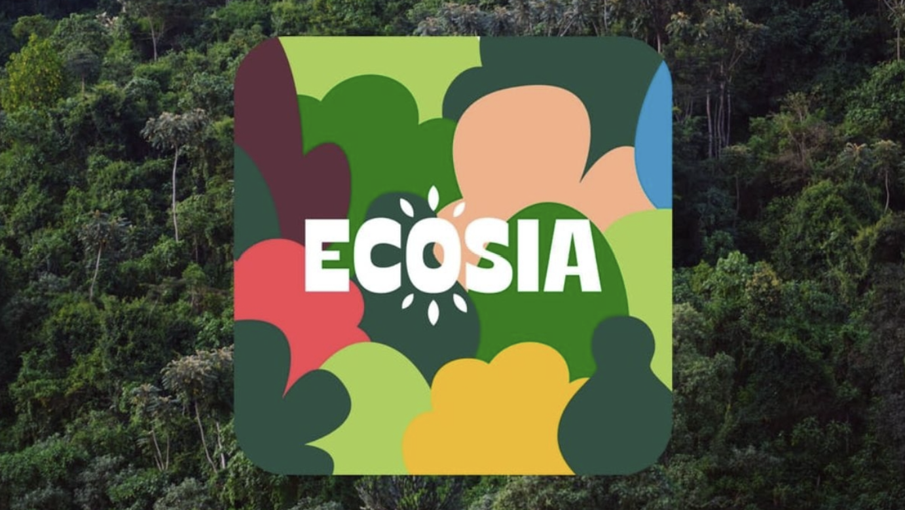

# Introduction
In a course like software engineering, it has become readily apparent that a digital revolution has occurred. AI tools have made it easier than ever to persist through the fundamnetals, and get to the real meat and potatoes of designing applications. A single prompt can bring forth a new perspective, a new use case, and a new ready-to-use tool. In many ways, the future has found its path. Throughout the course, I have only used two AI tools - each in their own disparate contexts. 

# My Jaunts with AI
To discuss my use of AI in the course, it is important to discuss the two contexts in which I used these tools. 

## 1-3 In-class/Practice/Experience WODS
For this, I used Ecosia AI for in-class WODs and practice WODs alike due to its browser accessibility. First, I used these tools to complete WODs if it felt like I was coming under the crunch - this was notably the case for React and Nextjs WODS where there was a lot of boilerplate code to do.

## 4 Final Project
Conversely, I used VScode's built-in Copilot extension for the final project especially when designing and debugging production features. This was due to the relative fine-toothed analysis that copilot was able to provide. 

## 5-14 Essays/ESLInter/Discord Participation/Misc. Activites
However, writing was left to my own imagination, and my participating in the discord was limited to say the least. As a result, I did not use Fixing ESLint errors was a job for human eyes only - especially type safety as the AI made peculiar mistakes. Writing, documenting, and reading code were all obviously incorporated in my usage of AI. Quality assurance and testing had to be done by me as it is unclear how an AI can accurately evaluate code. Overall, AI was integral to my success in the course, but I limited it to the less creative aspects of the course.

# My Learning; My Understanding
Overall, I would say that AI makes it infinitely easier to understand where things go wrong. However, it can make it challenging to come up with alternative patterns when the problem is deeper than compile-time errors. Type safety can be especially challenging to manage due to the idiosyncratic nature of AI design. In the end, I would still say my learning has been supplemented by the use of this tool rather than hindered. 

# Applications: Real Life
There are two major applications that span aa wide breadth of contexts and industries. AI is able to democratize the access to education when owned by the correct institutions, and it is able to enhance the outputs of technical workers by several fold. Through this, there is a chance that fields plagued by inequity can be leveled out and diversified in the pursuit of an improved future. Companies utilizing AI technologies to supplement human supervision will undoubtedly see a severalfold improvement in their output. 

# Old Challenges; New Opportunities
In general, the challenges I experienced included an insecurity around my ability to code and develop applications. Being able to deliver a final project has alleviated some of this concern. How much do I know? In reality, only time will tell as I gather more experiences. Many of these experiences are almost certainly likely to have been made accessible by AI. 

# A Comparative Analysis 
Traditional teaching methods are plagued by communication difficulties and source inaccessibility. AI can gather sources, build recommendations, and tailor experiences in favor of an individual's preferences and skillset. In this manner, every person can be addressed for their unique attributes in a way that traditional methods simply can not. Finally, there may be some considerations where assignments are done by hand to improve retention but AI could be used as a tutorial-like tool. 

# Future Considerations
In the future, we may have to consider how humans develop when exposed to AI usage, and whether there are social impacts at the public school level. In addition, we may have to consider productivity boosts relative to capital expenditure. Finally, we will have to consider the labor costs that this reduces, and how to compensate people accordingly. Overall, the institutions that have ownership over AI may necessarily change, and the methods of funding may also have to transform with the times. 

# Conclusion
From the beginning, I think AI was here to stay- for better or worse. The imperative lies on us to determine who owns it, who uses it, and how it is used. Ignoring it will only allow those with malicious interests to have a monopoly on the power, and the average person needs to be concerned on whether and how they use such a tool. I found that AI can be a tool for education and empower students, and students need to be taught to critically evaluate and think about such tools.
