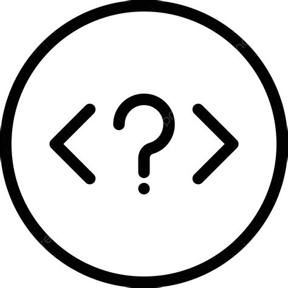

It was the only this past week that I encountered ESLint, an uncompromising taskmaster from both my dreams and my nightmares. This no-nonsense character has done nothing but drill its peculiar obsession with newlines at the ends of files and spaces before curly braces into my thick and hard skull. I find myself wondering what could possibly be the difference between single quotes and double quotes to this eccentric entity dwelling beneath my IDE, and what fuels this seemingly unfounded hatred that fills every line with its red warnings and errors. 

Yet sure enough, I find myself appreciating the aesthetic simplicity of my programs more now than when I am left to my own devices. Before, I had separated scopes with obnoxious indentation that strained against the width of the screen, and found myself frequently unsure of where exactly I wanted to leave a closing curly brace hanging. Admittedly, I now get to indulge myself with the "right" answer as given to me by the linter from on high, and this has left me with the relaxed eyes and greater focus that I need to focus on the task at hand. 
## Comfort in Compromise

This had left me with a bit of a realization. Coding standards have oft come about less from debates over correctness and aesthetic beauty, and more from the mutual desire for simplicity and compromise that teams want from each other. Considering that development projects have only ballooned in size over the past several decades - often having many teams that total up to hundreds or thousands of engineers, it's only reasonable to strive for the most simple template to maximize the comprehension and minimize the stress of everyone involved. If I find myself being able to comprehend and understand my very own brainchild at a higher degree of comfort and efficiency, I can only imagine how much benefit can be gained from the implementation of company-wide and team-wide standards when it comes to interacting with the work of other people. 

While one might imagine that there is a greater deal of effort in having to change you think to abide by arbitrary standards, the existence of modern development environments allow for auto-fixes with the click of a button. In VSCode, the chosen IDE for ICS 314, the process is called "QuickFix", and can automatically fix most linting errors. For the micro-managers at heart, every fix can be vetted before being automatically changed, or for greater convenience, an "autofix all QuickFixes" button can correct every linter error in your progam at once. One can even choose to ignore a linter error though this is likely not recommended. As a result, it may seem that the linter lords over you with its arbitrary rules and conventions, but it is in fact a tool that works for you at its heart. A linter exists truly at your convenience, and especially at the convenience of those around you. 

## A Tool to Help Others

Furthering my point from before, it is helpful to note that a linter can have its rules modified, and operate for different kinds of coding conventions depending on team and company policy. This is exceptionally important as it means in some ways, there is a democratic element to coding conventions that should cause a higher degree of concern when it comes to simply skipping out on the agreed-upon rules. Are you helping your coworkers to read by disabling indentation errors, or are you thinking about the future when ignoring type safety errors? The answer is likely no. The linter is something that helps everyone on the team, whether one person likes it or not. Nobody likes to work with a person who believes that they always know best. Because of this, I think we should take a pause and a moment for reflection whenever we consider rules or conventions or guidelines to be silly, illogical affairs. Are we thinking about the future and are we thinking about each other's interests? That should always be the first and last question in design.

