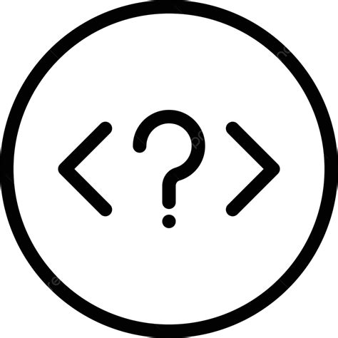

Slowly, the clock has been ticking. Ever since my near fatal scrape with ESlint, I've been paranoid and looking over both shoulders for this no-nonsense character with a peculiar obssession for newlines at the ends of files. The spaces before curly braces have beaten into my thick, hard skull. Wondering what could be the difference between single quotes and double quotes, I yield to this eccentric entity dwelling beneath my IDE - an eldritch god with a seemingly incalculable hatred. If a mortal dare not appease its shadow, every line fills and quakes with its red warnings and errors. 

Yet sure enough, I find myself appreciating the aesthetic simplicity of my programs more now than when I am left to my own devices. Before, I had separated scopes with obnoxious indentation that strained against the width of the screen, and found myself frequently unsure of where exactly I wanted to leave a closing curly brace hanging. Admittedly, I now get to indulge myself with the "right" answer as given to me by the linter from on high, and this has left me with the relaxed eyes and greater focus that I need to focus on the task at hand. 
## Epiphanies at Work

Having steeled myself against its gaze for eons at this point, I have been left with a number of epiphanies in the wake of this monster. Standards regularly come about despite the heated debates surrounding correctness and beuaty - our natural desire for simplicity and compromise lends itself towards regular consensus. Considering that development projects have peaked in size relative to the inception of the tech sector (in the range of hundreds to thousands), it becomes imperative to find the simplest template to work from. Considering I'm able to retain a better sense of my own workflow, it leaves me scarcely able to imagine the kinds of benefits that a set of standards can provide a team. 

Despite the great effort that it might take to resolve errors caused by arbitrary coding standards, the industry has adapted to include shortcuts for resolving such deviancies.  In VSCode, the process is called "QuickFix", and is able to resolve issues with the click of a button. For those who prefer a precise touch, any fix can be vetted before being automatically changed, or for greater convenience, an "autofix all QuickFixes" button corrects all linters simultaneously. It might be tempting to ignore a linter error though this isn't recommended. As a result, a linter is always (at its heart) at your beck and call despite its taskmaster appearance. Coding standards exist for your convenience, and especially for everyone else's sanity. 

## A Tool For Everyone

Continuing from my point from before, linters are easily customizable and operate for different kinds of coding conventions depending on team and company policy. This is notable as it means in some ways, there is democracy at work that calls attention to that fact when you decide to ignore these conventions. Are you helping your coworkers to read by disabling indentation errors, or are you thinking about the future when ignoring type safety errors? In all likelihood, this is not the case. A linter helps everyone on the team, irrespective of whether one person likes it or not. Nobody likes to work with a person who believes that they always know best. Because of this, I think we should pause and reflect upon our own antics when we believe that these rules are silly, illogical affairs. Are we thinking about the future and are we thinking about each other's interests? This is the first and last question in design.

