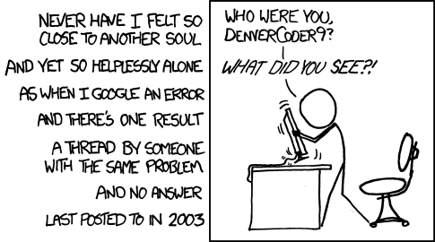

## Obscure Questions And The Dread of Necro-Posting

The oldest progenitor of hopelessness on the Internet slowly begins to creep into your mind, "What if nobody has ever experienced this before?". Quickly, you shake your head and banish the thought. "Surely, there must have been at least one poor soul with the very same issue that I have!", you assure yourself in the desperate hopes that your relentless searching will at last find its end in one obscure thread or another. Alas, you find a thread that has the same issue you did! You scan the title and the first sentence or two, and click the link. It's really beginning to feel like you've finally found the answer to your plea. But to your dismay, you find one reply asking for clarification on the question - dated 8 years ago! Just when you had thought that the online voyage you had undertaken was finally beginning to bear fruit, and you were finally starting to see land again - the clouds moved in, and the view of your better and brighter future on the horizon was swiftly taken from you. Forlorn, you find wishing yourself that the author had just asked a smarter question. Now, you must decide: do I post a question to a relevant forum myself or do I commit myself to the grave sin of necro-posting (raising the post from the dead by posting to this ancient thread)? For the former, perhaps it might be best to equip yourself with the tools for asking a proper question.  

## Well-Thought Questions 

When considering how one might ask and format questions, it might be best to consult an example. Some considerations include providing as much detail in as concise a description as possible, listing specifiations relevant to the question at hand, and makign the question as close-ended as possible. StackOverflow, a useful site for programmers to provide questions and answers to, is a community that strictly adheres to a culture of only providing thoughtful well-considered answers to thoughtful and well-considered questions. As a result, it is a great site to find and pick apart smart questions. 

In the [upcoming example](https://stackoverflow.com/questions/208105/how-do-i-remove-a-property-from-a-javascript-object), the user asks a relevant, specific, and close-ended question on the forum that facilitated efective and concise answers. The author of this question is trying to determine how to remove an object's property from an object in JavaScript - the details of this question are show below. 

```
Q: How do I remove a property from a JavaScript object?
Given an object:

let myObject = {
  "ircEvent": "PRIVMSG",
  "method": "newURI",
  "regex": "^http://.*"
};
How do I remove the property regex to end up with the following myObject?

let myObject = {
  "ircEvent": "PRIVMSG",
  "method": "newURI"
};
```

In this example, the heading of the question is short and meaningful which potentially allows an answer to be formulated with very additional information to be provided. Instead, the question continutes by giving an example of an object both before and after the deletion of a property. This further clarifies the bounds of the question so that there is no potential misunderstanding of what is meant by "removal" or the property of said object. As a result, this question is an excellent example of asking questions intelligently. Provided below, there is a sample answer that was given to this question in the thread.

```
A: To remove a property from an object (mutating the object), you can do it by using the delete keyword, like this:

delete myObject.regex;
// or,
delete myObject['regex'];
// or,
var prop = "regex";
delete myObject[prop];


var myObject = {
  "ircEvent": "PRIVMSG",
  "method": "newURI",
  "regex": "^http://.*"
};
delete myObject.regex;

console.log(myObject);

For anyone interested in reading more about it, Stack Overflow user kangax has written an incredibly in-depth blog post about the delete statement on their blog, Understanding delete. It is highly recommended.

If you'd like a new object with all the keys of the original except some, you could use destructuring.

let myObject = {
  "ircEvent": "PRIVMSG",
  "method": "newURI",
  "regex": "^http://.*"
};

// assign the key regex to the variable _ indicating it will be unused
const { regex: _, ...newObj } = myObject;

console.log(newObj);   // has no 'regex' key
console.log(myObject); // remains unchanged
```
 
There were 40 answer to this question in total, but this answer was one of the mostly highly voted answers. Of course, it is easy to see why. The very first sentence provides a direct answer to the question followed by multiple demos and examples. Then, a reference to another user's post about the delete keyword was provided if the user was interested. This referral to another poster is an excellent exercise in courtesy and humility which is another reason that this is such a great answer. Finally, an alternative using destructuring was provided in case the poster had different bounds that they needed to conform to. As a result, this thread was highly viewed and upvoted due to the clarity of questions and answers it provided. 

## The Death of A Question 

A question such as the one [below](https://steamcommunity.com/app/377160/discussions/0/4512128114436476359/). is not a particularly effective that warrants a thoughtful response. Instead, it invites derision and hostility towards the poster.

```
Q: Fallout London: f*ck this
So I did the downgrader, opened in GOG, plugged in the path and now it tells me "Current game build is not supported. Please install version 1.10.163.0 of the Fallout 4." I really don't want to buy the game on GOG. Any suggestions about wtf I'm doing wrong?
```

The subject line should not contain any particularly emotive language as that distracts from the question, and also might elicit a negative response to someone who might otherwise be helpful. In addition, only one attempt at a solution has been made with no details besides the error message. For additional context to this question, this is a thread about the installation of a file that modifies the game Fallout 4. As such, there happens to be a detailed installation guide that the poster has made no reference to following. In addition, the thread contains more posts from the author mostly complaining about the difficulty of installation rather than providing meaninful information about the problem. This invites negativity rather than productivity on the behalf of more expert posters. in response, the thread is often filled posters speaking of their own solutions with no way to tell if it is relevant to the poster as well as other posters mocking and arguing the original author. A question like this is better left unasked. 

## Conclusion

Considering others time and efforts should be our first priority when asking a question. We are, after all, at the mercy of their generosity, and should do well to remember that every person finds their time just as valuable as we find ours. Furthermore, it is good to keep in mind the general principles of asking good questions so that they remain unmocked and answered in a timely fashion. For everyone's sake, keeping our questions concise, well-mannered, and close-ended is the best way for everyone in the thread to go happy, healthy, and humble. 
