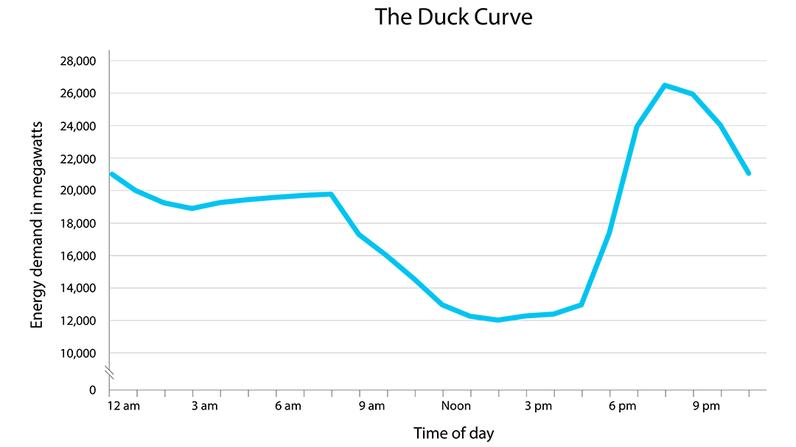

For the first semester of this long-term project by the Sustainability VIP, we researched and compiled a 30 page report and set plans for a simulator to simulate EV charging station load throughout the year with 15 minute sampling frequencies. This was done to investigate whether EV's will contribute to an increased risk for blackouts due to the additional load on certain portions of campus. In addition, we also wanted a way to determine whether V2G technology is viable in different areas of the campus as a way to reduce load during the peak demand hours as "alternative batteries". 

