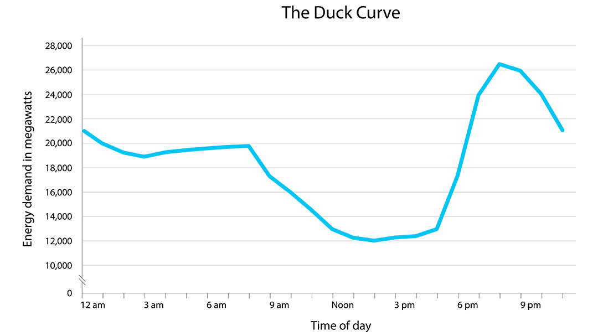

For my ICS 314 project, we were tasked with creating a React and Nextjs-powered website with the goal of providing a service to UH community members. In our project, we addressed the need of honest, accessible reviews for professors in the ICS department with the goal of localizing rating services while still allowing the flexibility of providing constructive criticism or praise. Users can browse courses, professors, and reviews as well as submitting some of their own. In addition, the service is provided with the framework that allows for a natural schedule builder extension, but this is relegated to future work. 

