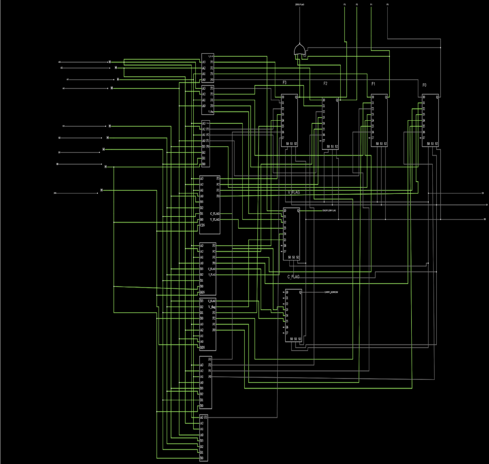

##ALU

For the digital design class I took in the Fall of 2023, I was tasked with making a final project that involved creating an ALU with 8 operations. This ALU would take up to two four bit inputs as well an operation it was expected to perform. The operation could be addition or subtraction with carry inputs, or logical operations such as AND or XOR gates. Pictured above, the image contains the internals of the ALU I designed which in turn contains components that also required designing such as multiplexers for selecting a data line. Of course, the top level of the circuit is just a single component with inputs and outputs, so the picture attached is one step below that to give insight into the actual internals of the ALU. Unfortunately, due to the way that Falstad (the service I used to create this project) creates links, it is not possible to link directly to the project as the url is too large.

However, a corresponding component of this project was to program the ALU in Verilog on EDAPlayground. Verilog is an HDL, hardware design language, which is a language used to specify circuits and their behavior. Rather than attaching components together through wire either digitally through Falstad or with real components, Verilog provides a way to program these circuits on FPGAs (Field Programmable Gate Arrays) which are integrated circuits that can be repeatedly programmed after their manufacturing date. A link to my EDAPlayground, a simulation service, is provided below with both the design file and corresponding testbench file.

Source: <a href="https://www.edaplayground.com/x/gKmU"><i class="large github icon "></i>ALU.v</a>
