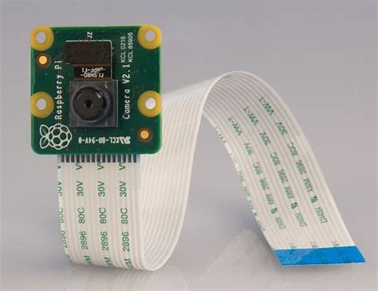

The Energy and Sustainability project is a relatively new project at UH Manoa and is a VIP project. A VIP (Vertically Integrated Project) is a student-led engineering project that incorporates students from multiple majors and as well as undergrauate to graduate students for a common engineering goal or project. In our case, we are seeking to assist UH Manoa in its net-zero energy usage by 2035 and carbon neutrality by 2050 initiatives. We have multiple new and ongoing projects including an analysis of campus building energy usage data and projected solar panel energy production in order to determine which building benefit the most from rooftop installation of solar panels. In addition, my team is working to determine how to automate gas meter readings across campus as they currently require manual labor, and do not provide continuous data.  

To be more specific, our goal is to read the dials and numbers on a gas meter in order using the openCV python library every 15 minutes with a camera, and upload this data to a database to do analysis on later. The project's aim is to reduce labor costs, gather continuous amounts of data, and use gas more efficiently across campus. To read these meters, we are using a Raspberry Pi, and a camera module attachment in order to take pictures and recognize digits before saving them to a file and uploading it remotely. 

Currently, the GitHub repository is private, but here is some code that illustrates how we are currently processing an image from a picture we take:

```cpp
import time
from picamera2 import Picamera2, Preview
from libcamera import Transform, controls
import cv2
import pytesseract

# Set the path to the Tesseract executable
pytesseract.pytesseract.tesseract_cmd = r'/usr/bin/tesseract'  # Adjust path as needed

# Create the camera 
camera = Picamera2()

# Create the configuration options for the camera and set config
camera.configure(camera.create_preview_configuration())

# Set camera controls
camera.set_controls({"Brightness": 1.0})

# Start the preview
camera.start_preview(Preview.QTGL, x=100, y=200, width=800, height=600, transform=Transform(hflip=1, vflip=1))

# Start the camera
camera.start()

# Stay in preview for a short duration before taking the image
time.sleep(2)

# Capture the image and save to a file
image_path = "captured_image.jpg"
camera.capture_file(image_path)

# Stop the camera after capturing the image
camera.stop()

# Function to process a single image and perform OCR
def process_single_image(image_path):
    # Load the image
    image = cv2.imread(image_path)
    
    if image is None:
        print(f"Error: Unable to load image from {image_path}")
        return

    # Convert the image to grayscale
    gray_image = cv2.cvtColor(image, cv2.COLOR_BGR2GRAY)

    # Apply a threshold to the grayscale image (preprocess for better OCR accuracy)
    _, threshold_image = cv2.threshold(gray_image, 150, 255, cv2.THRESH_BINARY)

    # Use Tesseract to detect digits in the image
    digits = pytesseract.image_to_string(threshold_image, config='--psm 6 digits')

    # Print the detected digits
    print(f"Detected digits: {digits}")

# Call the function to process the captured image and perform OCR
process_single_image(image_path)
```

