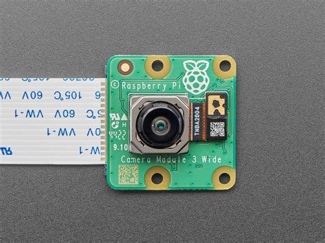

This was a project with the Sustainability VIP on campus where we created python scripts that implemented the ML (Machine Learning) Computer Vision model called YOLO in order to read gas meters across campus. Implementing smart meters is expensive, and the current strategy is a monthly manual reading. Our implementation that is still in the process of being completed is designed to take gas meter data and upload it to a csv file with 15 minute increments in between. We will then use this data to analyze patterns in gas usage across campus to think about possible reduction strategies. Currently, we can read the dials and collect information to be uploaded, but a proper case is still in the works to contain these cameras. 
