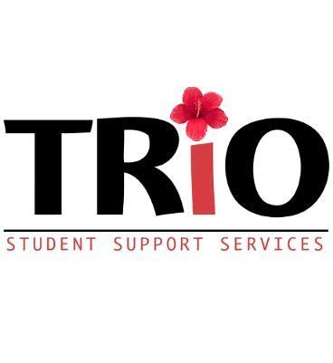

At Windward Community College, I am a peer tutor for the Ka Piko program in conjuction with my employment at TRiO services. Both of these programs are incredibly impactful at WCC in terms of allowing vulnerable students experience the safety and security that every student deserves. These include active donation services, free lunch programs, free tutoring and advising, and free counseling services independent of other departments at WCC and Manoa System campuses in general. Generally, every summer involves some sort of educational outreach program that I proudly participate in. This can include free Math 100 classes and specialized tutoring for first-time and non-traditional students, or high school dual enrollment classes that come with a supplemental instructor/tutor. 

In both of the above listed scenarios, I was very actively involved with for the past two summers. I am also often one of the only tutors for a variety of less common courses at WCC such as computer ccience and upper level physics and chemistry courses. I also have a broad range of mathematics courses that I am capable of tutoring for as I teach anything from remedial math up through the entire calculus series. As a result of my experiences with many students, I have become a very effective and personable technical communicator which I think is crucial for engineering and development roles. On top of that, my experiences have been nothing but fulfilling watching even the most struggling of students become remarkably successful in their academic careers. Because of this, I have complete intentions of continuing my services at Ka Piko and TRiO as I have for the past 2 years. 
